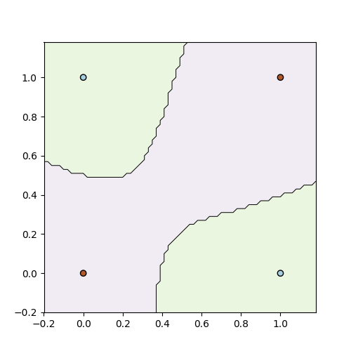

# NN-from-Scratch-to-PyTorch

Code for neural networks from scratch, and then abstractions of the functions to ones already implemented in PyTorch

---

## Theory

Please note that the theory corresponding theory is hosted on [[link]]

## Environment setup

Ensure the following is installed in your python environment:

- Numpy - required for vectorized operations
- Pytorch - required for automatic backpropagation over compute graphs (try installing the hardware accelerated version if possible)
- Torchvision - required for downloading the image datasets and pre-processing images when loading data
- Matplotlib - required for plotting results

## 0. Perceptron from scratch in numpy

Execute the following script to train a perceptron on a toy dataset.
```
$ python3 version0.py
```
The plots for the the learned decision boundary will be something as follows:
&nbsp;&nbsp;&nbsp;&nbsp;&nbsp;&nbsp;&nbsp;&nbsp;&nbsp;&nbsp;&nbsp;&nbsp;&nbsp;&nbsp;&nbsp;&nbsp;&nbsp;&nbsp;&nbsp;&nbsp;&nbsp;&nbsp;&nbsp;Linearly separable dataset&nbsp;&nbsp;&nbsp;&nbsp;&nbsp;&nbsp;&nbsp;&nbsp;&nbsp;&nbsp;&nbsp;&nbsp;&nbsp;&nbsp;&nbsp;&nbsp;&nbsp;&nbsp;&nbsp;&nbsp;&nbsp;&nbsp;&nbsp;&nbsp;&nbsp;&nbsp;&nbsp;&nbsp;&nbsp; |  Linearly inseparable dataset
:-------------------------:|:-------------------------:
 dataset fit")  |   dataset fit")
As can be noticed, since AND is linearly separable, the learned model is able to (over)fit the data. | However the XOR dataset is not linearly separable, and therefore the model is unable to (over) fit the data.

## 1. Neural Network (MLP) from scratch in numpy

Execute the following script to train a numpy MLP on a toy XOR dataset.
```
$ python3 version1.py
```
The plots for the the learned decision boundary will be something as follows:

Notice that due to the non-linear activations, the functions learned can be non-linear and hence can fit the linearly inseprable dataset (XOR).

## 2. MLP with auto back-prop using pytorch tensors

Execute the following script to train a MLP where we improved upon the previous version by abstracting out the automatic back-propagation step by creating the compute graph with pytorch tensors instead of the numpy arrays:
```
$ python3 version2.py
```
The outputs should be similar to version1.py.

## 3. MLP in Pytorch using pytorch Linear layers and optimizer

Execute the following script to train a MLP where we improved upon the previous version by using pytorch Linear layers instead of the layers we created in version1.py and version2.py. Additionally, we use PyTorch's optimizers library to train the model.
```
$ python3 version3.py
```
The outputs should be similar to version1.py and version2.py.

## 4. MLP in PyTorch trained on MNIST dataset

Execute the following script to train a MLP on MNIST dataset.
```
$ python3 version4.py
```
It is not very interesting to train on toy XOR datasets, so we trained the same MLP on MNIST handwritten digit classification dataset (albeit with more parameters).

### Note: The neural networks series is continued on [Github - parag1604/Basic-Image-Classification](https://github.com/parag1604/Basic-Image-Classification)